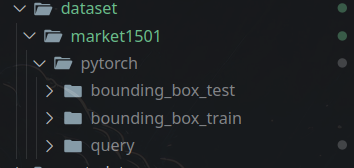

# PersonReID_ComputerVision
---
[toc]
## Overview
- Base line: OSNet from [deep-person-reid](https://github.com/KaiyangZhou/deep-person-reid/blob/master/torchreid/models/osnet.py).
- Repository structure:
  - `train.py`: Train each body part (to follow out pipeline, it should be run 4 times, each with a part).
    - The dataset used for training is expected to have the following structure:
        
  - `evaluation.py`: Compute *cosine similarities* of extracted feature vectors part-to-part. (like the `train.py`, it should be run for each body part).
  - `compute_score.py`: Combine the *cosine similarity* of each parts to compute the matching score between images from *query set* with images from *gallery set*.
  - `metrics.py`: Calculate *Rank-k* and *mAP* metrics.

## Result
- Market 1501 result: [Google Drive](https://drive.google.com/file/d/1Ft23f27cdU7GWlHO26BtHS9pFpGY-6Z1/view?usp=drive_link) (after extracting, it should be renamed to `saves`)
  - Training logs can be visualized by `tensorboard`
    ```bash
    $ tensorboard --logdir [path_to_log_directory]
    ```
  - Trained weight is named following the convention: `[body_part]_[input_shape]_[epoch].pt`
  - The `vectors` directory contains each part matrix, where
    - `gallery.npy`: normalized feature vectors of images from *gallery set*.
    - `query.npy`: normalized feature vectors of images from *query set*.
    - `sim.npy`: *cosine similarity* between part.

## Running the code
- Initialize and activate `python` virtural envirionment:
    ```bash
    $ python3 -m venv .venv
    $ source ./.venv/bin/activate
    ```
- Install depedencies:
    ```bash
    $ pip install -r requirement.txt
    ```
- Prepare the dataset:
    ```bash
    $ python3 prep_data.py --source [cropped_market1501_path] --destination [destination_path]
    ```
    - The next scripts expect the prepared dataset to be at `./dataset/market1501`.
- Train each body part:
    ```bash
    $ python3 train.py --dataset [path_to_body_part] --part [body_part]
    ```
    - For example, to train `whole` person image, it can be run by
        ```bash
        $ python3 train.py --dataset './dataset/market1501/bounding_box_train/whole' --part whole
        ```
    - Script for cleaning up intermediate repositories during train (Linux):
        ```bash
        $ ./clean_up.sh
        ```
- To compute similarities between parts of images from query and gallery dataset, run:
    ```bash
    python3 evaluation.py --gallery [path_to_gallery_dataset] --query [path_to_query_dataset] --weight [trained_model_weight_path]
    ```
    - For good result, you should load the model trained on the corresponding part.
- To compute matching score (combination of similarities between parts) and output result, run:
    ```bash
    python3 compute_score.py
    ```
    - This will output the score matrix into `final.npy` (`numpy` matrix).
- To calculate metrics on the computed score matrix, run:
    ```bash
    python3 metrics.py
    ```
    - Currently supported: Rank-k, mAP.